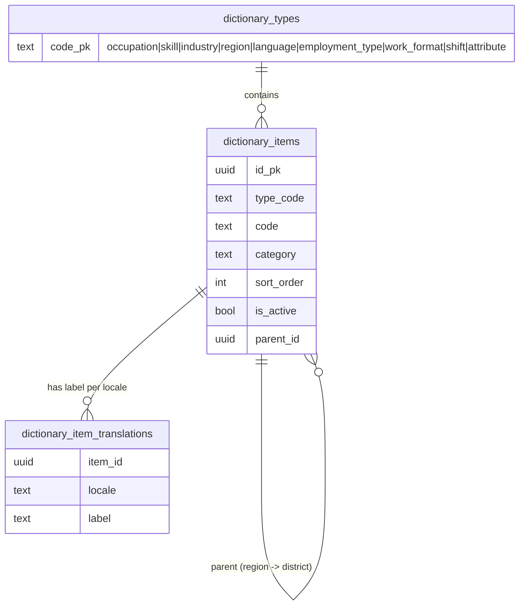
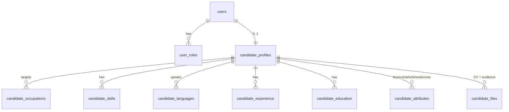

# headhunter-backend - Architecture

Design decisions for the JobBridge API, derived from
[docs/SPEC.md](docs/SPEC.md). Read this before adding a module; it explains the
few decisions that everything else depends on.

Companion client: `d:\Dev\tgbots\headhunter-app` (Flutter, Android + iOS).

---

## 1. What the specification forces

Five requirements drive nearly every structural decision. Everything else is
ordinary CRUD by comparison.

| Requirement | Source | Architectural consequence |
|---|---|---|
| Search must work identically in 4 interface variants | §3.3, BR-13 | Every filterable value is a **dictionary row with a stable ID**; labels are a separate translated table. Filters accept IDs, never text. |
| Candidate discovery must not depend on CV files | §1, §5.4 | The CV is an attachment. **Structured columns are authoritative** for all filtering. No CV parsing anywhere. |
| Profile fields adapt to work category | §5.2 | Occupations carry a **category**, and required/optional field sets are driven by that category server-side, not hardcoded per screen. |
| One account may hold several roles | §2.3 | `user_roles` is many-to-many. Authorization is evaluated per **(user, role, resource)** — never "the user's role". |
| Employer/vacancy actions are moderated and auditable | §1.1, §10.2, BR-08/BR-12 | Status changes go through explicit transitions that **always write an audit row**. Audit storage is append-only. |

Out of scope, and to be actively refused if requested mid-build (§2.4): public
website, desktop client, web admin panel, payroll/tax/HR records, in-app
payments, built-in video engine, automatic translation of user content,
automatic government-registry verification.

The admin panel lives **inside the mobile app** behind a role. There is no web
console, so admin endpoints are ordinary API endpoints with strict role guards -
not a separate service or auth scheme.

---

## 2. Module map

```
src/
  infra/                     cross-cutting: db, env, auth primitives, guards, files
  modules/
    auth/                    OTP, tokens, sessions, device confirmation
    users/                   identity, roles, locale, account status, deletion requests
    dictionaries/            occupations, skills, industries, regions, languages, attributes
    candidates/              candidate profile + experience/education/skills/languages/files
    employers/               company & individual employer profiles, verification submissions
    vacancies/               vacancy CRUD, requirements, status machine, moderation queue
    discovery/               candidate-facing vacancy search & recommendations
    candidate-search/        employer-facing structured candidate search, saves, shortlists
    applications/            applications, stage history, withdrawal
    invitations/             direct employer invitations and responses
    interviews/              scheduling and candidate responses
    chat/                    conversations, messages, read state
    notifications/           in-app records, push dispatch, preferences
    wallet/                  employer Coin wallet, the append-only ledger, Candidate Unlock
    privacy/ (in infra)      BR-09's rule and the one "what entitles this employer" query
    payments/                Payment Orders and the Payme/CLICK provider seam
    admin/                   dashboard, verification, moderation, users, dictionaries, audit
```

`wallet` and `payments` are separate for the reason §12.7 requires: the ledger must stay
payment-provider agnostic, so the dependency points one way only. `payments` imports
`wallet`; `wallet` knows nothing about providers, and `wallet_transactions` has no provider
column. A store build that has to substitute Apple IAP adds an adapter in `payments` and
changes nothing in `wallet`.

`discovery` and `candidate-search` are deliberately separate modules despite both
being "search": they have different authorization rules, different filter sets,
and different ranking. Merging them produces a permission-shaped mess.

Architecture is **lean modular** (Controller → Service → Repository once data
access earns one). No CQRS buses or DDD entities - see [CLAUDE.md](CLAUDE.md).

---

## 3. Localization model

### 3.1 Locale codes

Four interface variants, but only three languages - Uzbek ships in two scripts
(§3.1). Canonical internal codes:

| Canonical code | Interface option | `x-lang` aliases accepted |
|---|---|---|
| `uz-Latn` | O‘zbekcha (Lotin) | `uz`, `uz-latn`, `uz_Latn` |
| `uz-Cyrl` | Ўзбекча (Кирилл) | `oz`, `uz-cyrl`, `uz_Cyrl` |
| `ru` | Русский | `ru-RU` |
| `en` | English | `en-US`, `en-GB` |

**Why BCP-47 internally rather than the house `uz`/`oz` shorthand:** the Flutter
client's `Locale` maps to `uz-Latn` / `uz-Cyrl` directly, and `oz` is opaque to
anyone who has not seen it before. But `d:\Dev\digital-edo-api` already uses an
`x-lang` header with `uz`/`oz`, so the **header accepts those aliases** and
normalizes them. Alignment where it is free; no ambiguity in the data model.

Reuse the `XLang` decorator pattern from
`d:\Dev\digital-edo-api\src\infra\api\decorators\x-lang.decorator.ts`, but with a
strict allow-list and normalization to the canonical codes above - the existing
one passes arbitrary strings straight through, which we cannot do when the code
is used as a translation-table key.

### 3.2 Dictionary storage



Rules that follow from BR-13 and §3.2:

- `dictionary_items.id` is the **only** thing stored on profiles, vacancies and
  filters. A label is never persisted as a foreign value.
- A translation row is required for **all four locales** before an item may be
  activated. Enforce in the admin write path, and assert it with a test - a
  half-translated dictionary is how technical keys leak into the UI.
- Missing translation at read time falls back `uz-Cyrl→uz-Latn`, anything→`en`,
  and **logs a warning**. It must never return the code (§3.2).
- Deactivating an item keeps it resolvable for historical records; it only
  disappears from pickers. Never hard-delete a dictionary item that is
  referenced.
- Skills merging (§10.3) needs a `merged_into_id` column so old references
  resolve to the surviving item.

`region` is self-referencing (region → district/city). Languages carry CEFR
levels `A1..C2` plus `native`, stored as an ordered enum so `>= C1` is a range
comparison rather than a set membership test.

---

## 4. Candidate data model



Decisions:

- **`candidate_skills` / `candidate_languages` are rows, not JSON.** They are
  filtered with level comparisons and "match all" semantics; JSON containment
  cannot be indexed usefully for that.
- **`candidate_attributes` is a typed key/value table** keyed by dictionary item
  (driving licence, vehicle, tools, field-work readiness, crew work). §5.2 says
  the relevant attribute set varies by occupation category, so a fixed column per
  attribute would mean a migration per new work type. Value column is
  `bool`/`numeric`/`item_id` by attribute kind.
- **`visibility`** is an explicit enum: `searchable`, `hidden`,
  `visible_after_apply` (§5.1 Privacy). BR-02 means global search filters on
  `visibility = 'searchable' AND is_complete`.
- **`completeness_percent` and `is_complete` are stored, not computed per query.**
  Search filters on them (§7.1 "minimum completeness"), and recomputing across
  six child tables per search row is exactly the cost the 3-second budget cannot
  absorb. Recompute on profile write.
- **`last_meaningful_update_at`** is separate from `updated_at`: §5.3 requires
  showing the last *meaningful* update, and §7.1/§7.3 allow sorting by it.
  Touching a privacy toggle must not make a stale profile look fresh. Structural
  rather than conditional: visibility has its **own route**, which is the only
  write that does not refresh it, so no branch decides "was this meaningful".
- **`candidate_attributes` is the generic store for any engine field without a
  column or a child table of its own** - every §5.2 category field, plus the core
  multi-selects (employment type, work format, shift, industry). One row per scalar
  field, one row per selected id for a multi-select, keyed by the **schema field's
  code**. That is what makes an attribute filter an ordinary indexed join in M7 and
  a new work-type field a data change rather than a migration.
- **`gender` is a dictionary reference, not a native enum.** §4.2's `kind` union has
  no `enum` member, the four labels have to come from somewhere, and BR-12's vacancy
  restrictions must reference the same ids the profile stores. It is the 15th
  dictionary type; adding one is additive, because a field names its own
  `dictionaryType` and the client fetches whatever is named.
- **A calendar date is a string end to end.** `date` columns come back as
  `'YYYY-MM-DD'` (`infra/db/pg-types.ts` plus `--date-parser string`), because
  node-postgres otherwise parses one into local midnight - a value with a time and
  a zone standing in for one that has neither, which shifts a birth date by a day
  whenever the server's zone and the platform zone disagree.

### 4.1 Completeness (§5.3, BR-02)

Two answers from one pass, and the distinction matters:

- **`completeness_percent`** is measured over *every* entry the category's form has
  - engine fields plus experience and education as one entry each. A percentage over
  only the mandatory fields would move in 20-point jumps and tell an employer
  nothing (§7.1 filters on "minimum completeness").
- **`is_complete`** is only about the *required* entries. It is BR-02's gate, so it
  must never be a threshold on the percentage - "80% complete" would otherwise let a
  profile with no occupation into search.

`missingFields` carries both, flagged, so §5.3's "missing mandatory fields with
direct edit links" and the client's optional-gap prompts come from one list.

A consequence of the contract worth knowing: a bespoke section has no fields, so
`requiredForSearchable` can never name experience or education (§4.1 requires every
code there to resolve to a rendered field). BR-02 therefore never blocks on having
entered a job - completeness still counts them, so an empty history shows up as a
percentage rather than a locked profile.

### 4.2 The field schema is one declaration, not three

`modules/schemas/candidate-profile.schema.ts` is the client's form, the server's
write-validation table **and** the completeness definition. Each field carries its
labels, its requiredness per category, and where its value is stored.

*Why:* three separate lists are three chances for a field to be required in one and
unknown in another, and API_CONTRACTS.md §4.1 promises that every code in
`requiredForSearchable` resolves to a field the client can focus. With one
declaration that is true by construction; with three it is true until someone edits
one of them.

The published version lives in `schema_versions` and is copied there from the
declaration by `pnpm seed`. A content hash was rejected: not every edit needs a
refetch, and hashing would make a reordered comment invalidate every cached form.

---

## 5. Candidate search

The hardest performance requirement: first result page within 3 seconds under
normal load (§12.4), with ~11 filter groups (§7.1).

**Start with normalized tables and indexed joins. Do not build a search engine
yet.** Postgres handles this size of problem well, and a premature Elasticsearch
introduces an index-sync problem plus a second source of truth for privacy
rules - the one thing that must never drift.

Query shape:

- Filter `candidate_profiles` first on the cheap, highly selective, indexed
  predicates: `visibility`, `is_complete`, region, occupation, availability.
- **Skills "match all"** (§7.1): semi-join with
  `GROUP BY candidate_id HAVING COUNT(DISTINCT skill_id) = :n`.
  **"match any"**: plain `IN`. These are different plans; do not unify them
  behind one clever query.
- **Language + minimum level**: join on language item with `level_rank >= :rank`,
  which is why levels are an ordered enum.
- Indexes to create with the tables, not later: `candidate_occupations(item_id,
  candidate_id)`, `candidate_skills(item_id, level_rank)`,
  `candidate_languages(item_id, level_rank)`, and a composite on
  `candidate_profiles(visibility, is_complete, region_id)`.

**Count-before-open** (§7.2) is a separate cheaper endpoint returning only a
count. The spec says "where technically reasonable", so cap it: run the count
with a `LIMIT`-bounded estimate and return `{count, isExact}` so the client can
render "200+" rather than blocking on an exact count of a huge set.

**Ranking** (§7.3) needs a match score. Compute it as a weighted sum of matched
requirement groups in SQL, and return the per-group breakdown - "why did this
candidate rank here" is the first question an employer asks.

**Escape hatch, documented deliberately:** if measured p95 breaks the budget,
add a denormalized `candidate_search_projection` table maintained on profile
write, before considering a separate search engine.

*Measured in M11 and the hatch stayed shut:* at 200 000 searchable candidates the
worst p95 is 231ms against the 3s budget
([docs/PERFORMANCE.md](docs/PERFORMANCE.md)). The unfiltered search is linear in
the searchable population, though, so the doc names the volume that reopens this
(500k) - and the first thing to try is **not** the projection but letting the
recency sort stop early: page `candidate_profiles` alone, then do the lateral
per-row work on the twenty rows that survived. That keeps one source of truth,
which a projection does not.

Two hard authorization rules the search path must enforce server-side (§7, §11.1,
BR-09): only **verified** employers may search at all, and result cards must
never include phone or full contact details.

*Built in M7, and five decisions are worth carrying forward.*

- **The query is four stages, in this order:** filter and count matches, turn the counts
  into §7.3's score, sort and take the page, and only then build the cards. The card's
  nine correlated subqueries and two lateral joins therefore run for at most `limit`
  candidates rather than for every match — which is what makes the 3-second budget a
  property of the filters rather than of the size of the database.
- **The score's weights and the response's explanation come from one function.**
  `scoreGroups(filters)` decides which groups take part, what each was asked for and what
  it weighs; the SQL expression is built by iterating that list, and the breakdown the
  client renders reports the same objects. Two definitions would drift into a ranking
  nobody could explain.
- **A card is not a hiring interaction, so BR-09 is not consulted for one.** §11.1 is
  unconditional there, so the card type has no contact field and the query never joins
  `users` — stronger than fetching a phone number and nulling it, and asserted
  mechanically over the compiled SQL. Contact details live on the profile view, which
  goes through M6's single BR-09 gatherer.
- **The profile photo is the one exception to files being BR-09-gated.** §7.3 puts a
  photo on the card and §5.4 keeps documents behind an interaction; both hold because a
  photo uploaded to be found by is not a document. The exception is one route, one
  purpose code, searchable profiles only.
- **Where §7.1's wording and the data model disagree, the id-shaped form wins.**
  Specialization was free text and is now a `specialization` dictionary on both the
  candidate profile and the vacancy (M7, on client direction): a substring match on prose
  cannot behave identically in four interface variants (§3.3, BR-13). "Remote-work
  readiness" is likewise a `work_format` id rather than a boolean. And §7.3's location
  proximity is **tiered** — same district, then same region — because places here are
  dictionary ids in a two-level tree, not coordinates; its reference point is its own
  filter field, since filtering by district would exclude everyone the sort exists to
  order.

---

## 5a. Employers and verification

Two employer types with different fields (§6.1), so **company detail is its own
table** rather than a set of nullable columns: which fields must be filled becomes a
property of the schema instead of a rule in code, and an individual employer does not
carry eight columns that can never apply.

Verification keeps **the current state on the employer and the attempts as rows**.
Both are needed — §6.1 shows the employer one status, while an administrator
reviewing a resubmission needs to see what was sent before and why it was refused —
and the status is written in the same transaction as the submission that changes it.

- **Transitions live in one place** and every one writes an
  `employer_verification_history` row in the same transaction (BR-08). The method
  that sets the status is private, so no caller can change it without the audit row.
- `verified` is **terminal** in this machine. Revoking it is an administrator action
  against a *user* (§10.4), not a step here; treating it as one would let an employer
  resubmit their way out of a revocation.
- **`EMPLOYER_VERIFICATION_ENABLED` is off until M10.** With no admin module nobody
  can approve a submission, and BR-03 would strand every employer in `under_review`.
  The automatic approval still writes its history row, with a null actor and an
  `auto_verified_no_reviewer` reason.
- **`is_complete` is stored**, like the candidate's, because BR-03 is read on every
  vacancy submission and invitation.

### 5a.1 An open policy question, answered as data

§6.1 requires "verification documents if required" and "identity verification data
if required by policy", and no policy exists. Rather than block the milestone, the
requirement is **declared** in `employer-requirements.ts` — per employer type, with a
`spec | client | default` provenance tag and a note per value, exactly as dictionary content
declares its own provenance. The `file_purpose` rows it names are seeded regardless,
so the client renders the upload slots today and the answer arrives as one file edit.

The same move is available for BR-12's permitted age/gender justifications, which is
the remaining decision blocking M5's moderation.

## 6. Vacancies, applications and status machines

Statuses are explicit and transitions are validated in one place per aggregate.

**Vacancy** (§6.4): `draft → under_moderation → active → paused → active`,
`active|paused → closed`, `under_moderation → rejected → draft`.

**Application** (§8.1): `submitted → viewed → shortlisted → interview → offer →
hired`, with `rejected` reachable from any employer-controlled stage and
`withdrawn` candidate-controlled up to an accepted offer (§5.6).

Enforcement points:

- **BR-07 (one active application per vacancy)** is a **partial unique index**,
  not a service-layer check: `UNIQUE (vacancy_id, candidate_id) WHERE status NOT
  IN ('withdrawn','rejected')`. A concurrent double-submit from a flaky mobile
  connection must fail in the database.
- **BR-06 (no applications after deadline or closure)** is checked in the same
  transaction as the insert, reading the vacancy `FOR SHARE`.
- **BR-08 (every status change recorded with time and actor)** →
  `application_stage_history(application_id, from_status, to_status, actor_user_id,
  actor_role, reason, created_at)`. Written in the same transaction as the status
  update. A status change without a history row is a bug, so make the service
  write both or neither.
- **BR-05** worker count `>= 1` as a check constraint.
- **BR-12** age/gender restrictions on a vacancy require a stored justification
  and force `under_moderation`; the audit row records the admin decision. Two
  properties worth stating, because both are easy to undo by accident:
  - **The justification is an id from an enumerated list, never prose.** BR-12
    requires moderation to *validate* the reason, and prose cannot be validated. The
    list's labels are a dictionary; the rule about which reason supports which
    restriction is code, because a dictionary row is admin-editable and widening
    BR-12 must not be a content edit. The CHECK constraint refuses a restriction with
    no justification at all, so no write path can produce one.
  - **It overrides `MODERATION_ENABLED`.** A restricted vacancy waits for review even
    when nothing can review it, which means it cannot publish before M10. That is the
    safe failure: the flag exists so *ordinary* vacancies are not stranded, not so a
    restriction can skip the review the specification requires for it. Changing a
    restriction on a live vacancy sends it back for the same reason, which is why
    `active → under_moderation` is a legal transition.
- **BR-11** closed vacancies leave active discovery but stay in history - a
  status filter, never a delete.

**Invitations** (§8.2, built in M7) are the fourth machine, and the smallest:
`sent → accepted | declined | details_requested`, then `details_requested → accepted |
declined`. Four things about it are decisions rather than transcription.

- **Every transition is the candidate's.** Unlike §8.1's stages there is no "who may set
  this" column, because there is one answer - so the response route is candidate-only and
  the service checks ownership instead of consulting a table.
- **`details_requested` is a question, not an ending**, and asking twice is refused: a
  second identical row would record that nothing happened.
- **No `withdrawn`, no `expired`.** Neither is in the specification, and a status nothing
  can set is a state every reader has to consider for nothing.
- **The two shapes are exclusive in the schema.** A CHECK requires exactly one of
  `vacancy_id` and `occupation_id`, so "an invitation to a vacancy that also states a
  different occupation" is unrepresentable - the same move as M4's `employers` /
  `companies` split, which makes "which fields must be filled" a property of the schema.

One open invitation per (employer, candidate, vacancy) is a partial unique index with
**`NULLS NOT DISTINCT`**, which is load-bearing: without it two general invitations - both
with a null `vacancy_id` - would count as different rows and an employer could send
unlimited ones.

---

## 7. Offline-safe writes and idempotency

§12.4 requires "safe retry without duplicate application, invitation, or message
creation". Mobile clients retry; assume it.

Every non-idempotent write endpoint (apply, invite, send message, schedule
interview, upload) accepts an **`Idempotency-Key` header**. Keys are stored with
the resulting resource id and a request fingerprint:

- Same key + same fingerprint → return the original response, do not re-execute.
- Same key + different fingerprint → `409`, because the client reused a key for a
  different request.
- Keys expire after a documented retention window.

This is separate from BR-07's unique index: the index prevents logical
duplicates, idempotency keys make an interrupted-but-successful request safe to
retry and let the client distinguish "already done" from "conflict".

*Built in M6 (`infra/idempotency`), and two details of the implementation matter.*
The key is **claimed before the work runs**, so two concurrent retries cannot both pass
the check - the second conflicts on the primary key, waits, and then finds the first
one's result. Checking first and inserting afterwards would leave exactly the window the
mechanism exists to close. And what is stored is the **resource id, not the response
body**: a cached body would go stale the moment the resource changed, and re-reading
keeps one source of truth for what the client gets back.

---

## 8. Authorization

Multi-role accounts (§2.3) mean the question is never "what role is this user"
but "may this user, acting as role R, do this to resource X".

- Access token carries `sub`, `roles[]`, and an **`active_role`** claim; the
  client switches role explicitly and the server validates the requested role is
  actually granted.
- Guards compose: authenticated → role granted → resource ownership → account
  status. Follow the guard layout in
  `d:\Dev\digital-edo-api\src\infra\api\guards\` (`authorization.guard.ts`,
  `role.guard.ts`, `permission.guard.ts`) - same shape, same testing approach.
- **BR-10 (blocked users)** is enforced by a guard on every mutating route, not
  per module. A blocked account must fail vacancy, application, invitation and
  message creation with a clear reason (§13.1 UAT-14).
- **BR-03**: employer profile completeness is a precondition on invitation and
  vacancy-submit routes.
- **BR-09**: contact-detail exposure is decided in **one pure function**,
  `infra/privacy/contact-exposure.ts`, taking (viewer, visibility, interaction state).
  Never inline this rule per endpoint - it will drift, and drifting is a privacy
  incident. Built in M6 rather than M3, because two of its three inputs did not exist
  before then; until they did, a CV was owner-only, which is stricter than the rule.
  Three properties to preserve:
  - It returns a **reason code** as well as the two booleans, so §11.1's "access to
    protected data is logged" produces a log that can distinguish an employer who was
    entitled to a phone number from one who asked and was refused.
  - **Files and contact details are one decision.** §5.4 and §11.1 draw the same line,
    so a state where one is allowed and the other is not would be a rule nobody wrote.
  - **A search card is not an interaction.** §11.1 forbids a phone number on one, and M7
    took the stricter route than nulling one: the card query never joins `users` and the
    card type has no field for a phone number, asserted over the compiled SQL. A rule
    whose answer is always "no" is not a decision worth making at runtime.
  - **The interaction is derived from data, never from an id in the URL.** M7 found this
    the hard way while adding the second entry point: a withdrawn application is still
    addressable, so trusting the path would have let a view requested *through* the
    withdrawn application re-grant the exposure the withdrawal took back.
  - Both interactions now exist. An accepted invitation (§8.2) is the second, and adding
    it was one line in the gatherer and no change to the rule - which is what passing both
    flags explicitly bought. The gatherer reads the `invitations` table directly rather
    than injecting that module, because the invitations module imports *it* for the
    invitation-scoped download route; a module cycle for one `SELECT` would be a worse
    trade.
  - **Three entitlements now, and the third is bought rather than earned** (M12, §11.1's
    "successful Candidate Unlock"). The same one-line addition, for the same reason - but two
    things about it are not obvious:

    **`hasUnlock` has to be part of the *no-entitlement* condition, not just the granting
    branch.** Leave it out and an employer who paid, whose candidate then hides their profile,
    is refused with `hidden_by_candidate`: contact that was paid for, denied, with a log line
    as the only symptom. An unlock is a purchase, not a request a candidate can take back by
    leaving search - and §5.3's `hidden` already does not silence a candidate who applied.

    **`not_verified_employer` short-circuits before any of it, and must keep doing so.** §7
    makes verification a precondition, so an employer must not be able to *buy* past BR-03.
    That is the one path by which this change could have leaked a phone number, and the test
    that guards it enumerates every entitlement rather than only the unlock.

    Precedence is application, then accepted invitation, then unlock. All three grant
    identically, so it decides only what the log and the client are told - and an employer who
    holds an application should not be shown a purchase as the reason they are allowed.
  - **`no_interaction` became `unlock_required` with M12.** The reason codes are a contract the
    client renders copy from, and the old name described a world where the only remedy was
    waiting for the candidate to act. It is a coordinated breaking change, recorded in
    API_CONTRACTS.md §4a.

### Auth flow

**Decided 2026-08-05 (client direction, second): login is §4.1's phone + OTP.** This
supersedes the Telegram decision taken earlier the same day; that path is now
deprecated but still working, and is documented below because its reasoning is worth
keeping.

The flow is `POST /auth/otp/send` then `POST /auth/otp/verify`, both public, both rate
limited per phone and per IP. Registration and login are the same pair of calls — the
client cannot know which it is performing, and a route that distinguished them would be
a register of which numbers have accounts. Consuming a code is what verifies the
number, so BR-01 holds by construction rather than by a separate check.

**No SMS provider is bought yet, and that shaped exactly one line of code.**
`OTP_STATIC_CODE` substitutes a fixed code at the point `generateOtpCode` would be
called, inside the same transaction, and nowhere else. Everything downstream — the
hash, the row, the TTL, supersession of the previous code, the attempt counter, the
`FOR UPDATE` lock, single-use consumption — is the production path, exercised by the
same tests.

*Why the substitution goes there and not in `verify`:* a `verify` that accepted a magic
value would be a second, simpler code path, and the day the provider arrives the branch
that has actually been exercised is deleted and the one nobody has run becomes live.
Putting it at generation means clearing one environment variable is the entire removal.

*Why it is refused in production by Joi rather than by a note in a runbook:* a fixed
code is a master key to every account on the instance. `NODE_ENV=production` with a
non-empty `OTP_STATIC_CODE` fails at boot; a mismatch against `OTP_LENGTH` also fails
at boot, because the alternative is a client rendering six input boxes for a code that
does not fit them. And while it is set, every startup logs a warning.

*What is still owed:* the provider itself — Eskiz.uz, per client direction — plus the
delivery seam it plugs into. `OtpService.send` currently issues and stores a code and
tells nobody; sending is additive, and the natural shape is one injected sender
interface with a no-op implementation, added when there is a second implementation to
justify it.

#### Telegram login *(deprecated 2026-08-05, still working)*

Kept rather than deleted: the verification is correct, its tests run, and it remains
the cheapest way to re-add a verified-identity path. Setup guide:
[docs/TELEGRAM_LOGIN_SETUP.md](docs/TELEGRAM_LOGIN_SETUP.md).

The app uses Telegram's official native SDKs, which run OAuth2 + PKCE against
`oauth.telegram.org` app-to-app and return an OpenID Connect `id_token`. The client
posts that token to `POST /auth/telegram`; we verify it and issue our own session.

Four checks decide whether a token is trusted, and the third is the load-bearing one:

1. **Signature** against Telegram's JWKS — `jose` handles `kid` selection and key
   rotation, which is the part not worth hand-rolling on a security path.
2. **Issuer** is exactly `https://oauth.telegram.org`.
3. **Audience is our bot id.** A genuine, correctly signed Telegram token issued for
   any other application must not sign anyone in here, and this check is the only
   thing preventing it. It is what makes accepting a client-supplied `id_token` sound
   rather than merely convenient — the same reasoning as Google or Apple sign-in on
   mobile.
4. **Age** — `iat` within a short window, so a captured token is refused while `exp`
   is still in the future. OIDC's `nonce` is the stronger defence but needs the client
   SDK to accept a server-issued nonce, which the current Flutter package does not
   expose; the claim is verified when present, ready for that.

**Identity model consequences.** `telegram_user_id` becomes the credential and
`users.phone` becomes nullable, with a CHECK that at least one is present — a row
with neither is unreachable by every login path. The `phone` scope's
`phone_number_verified` claim is what keeps the product's phone-based model working,
and `TELEGRAM_REQUIRE_PHONE` (default on) refuses a login without it: BR-09 contact
exposure has nothing to reveal without a phone number, and telling the user at login
beats letting them discover it after building a profile.

**Account linking** is what makes the switch survivable. A Telegram login carrying a
verified phone that matches an unclaimed account attaches to it, with an audit row,
rather than creating a duplicate. Only a Telegram-verified phone is ever matched on;
matching an unverified one would be an account-takeover primitive. An account already
claimed by a different Telegram user is never taken over — realistic rather than
theoretical, since mobile numbers are recycled.

Common to both paths: OTP records store a **hash**, never the code; TTL, resend delay
and attempt limits are server config (§4.2). Rate limit per phone **and** per IP
(§12.5). Sessions are listed and individually revocable, plus "terminate all" (§4.2).
Refresh tokens rotate on use with reuse detection.

Still owed from §4.2 either way: new-device and phone-change confirmation.

---

## 9. Files

§11.1 forbids permanently public links; §5.4 requires CV upload/replace/delete
with progress and retry; §12.5 requires type/size validation and malware scanning
where infrastructure permits.

**Decided 2026-08-04: storage is the Telegram Bot API.** Bytes are sent with
`sendDocument` to one fixed chat; a `stored_files` row owned by this service holds
the metadata; retrieval is `getFile` followed by a download. Client direction, and
it removes an object-storage dependency from the deployment entirely.

What that choice forces, and why the code looks the way it does:

- **Downloads are proxied, not redirected.** Telegram's file URL is
  `api.telegram.org/file/bot<token>/<path>` — unauthenticated, and it contains the
  bot token. It can never reach a client, so `GET /files/:id/content` streams the
  bytes after an ownership check. This satisfies §11.1 more strictly than signed
  URLs would: there is no URL to leak.
- **The ceiling is 20 MB, not 50.** A bot may *send* 50 MB but `getFile` refuses to
  *download* above 20 MB, so the upload limit is validated against the download
  ceiling at boot. Above it, a file would store successfully and be permanently
  unreadable. The client contract's 10 MB (§4.1) sits comfortably under.
- **No path is ever persisted.** It expires in about an hour, so it is fetched per
  download.
- **`file_id` is per-bot.** Replacing `TELEGRAM_BOT_TOKEN` orphans every stored
  file rather than merely re-authenticating, which makes the token part of the data
  layer. `file_unique_id` is stored alongside because it is stable across bots and
  is what a future migration would reconcile against.
- **A SHA-256 of the uploaded bytes is stored and verified on read.** Serving an
  employer a document that is not the one the candidate uploaded is worse than
  serving none.
- **Deletes are soft**, and Telegram's message deletion is best effort — it refuses
  messages older than 48 hours. The metadata row is what every read goes through,
  so a deleted row is unreachable regardless of the residue in the chat.

Two consequences worth stating plainly, since they are properties of the storage
choice rather than of the code: uploaded documents live in a Telegram chat, so that
chat's membership is part of this product's privacy surface and it should be a
private channel whose only other member is the bot; and file retention is bounded
by that chat's existence, not by our database.

Validation is content-based (§12.5): extension, declared MIME type and magic bytes
must agree, which is what stops a renamed executable being accepted as a CV. A
generic `application/octet-stream` is tolerated because mobile pickers send it.
This is not malware scanning; §12.5 asks for that "where infrastructure permits",
and Telegram performs none on a bot upload.

---

## 10. Chat, interviews, notifications

- **Chat is gated, not open** (§9.1): a conversation may only exist where an
  application, invitation, or other permitted interaction exists. The gate is a
  server-side check on conversation creation *and* on message send - a
  conversation whose interaction later closes becomes read-only (§9.1).
- Messages support text and approved attachments. Sent/delivered/read state is
  per-recipient. **No voice or video** (§2.4); an interview may carry an external
  meeting link as a plain string (§8.3).
- **Interviews** store type (phone/in-person/external link), timestamp in the
  configured zone, location-or-link required by type, instructions, and the
  candidate's confirm / request-another-time response.

*Built in M8, and five decisions are worth carrying forward.*

- **Nothing records that a conversation is permitted.** The gate is asked live, of
  `HiringInteractionService`, on every send. A flag written at creation would have to be
  un-set by everything that can end an interaction - a withdrawal, a declined invitation
  - from modules with no reason to know chat exists, and the failure mode is a channel to
  somebody who has left. Asking live also makes §9.1's read-only rule free, and reopening
  free with it.
- **That service is the third caller of one question**, after BR-09's gatherer and the
  employer's candidate view. It lives in `infra/privacy` with no module dependencies, so
  nothing can form a cycle around it, and the two rules it feeds - who may see a phone
  number, and who may send a message - cannot drift apart.
- **Read state is two timestamps on the conversation.** There are exactly two
  participants, so "has the other side read this" is one comparison and the unread count
  is one aggregate; a `message_reads` table would carry a row per message per person to
  answer the same question. **There is no `delivered` state** until M9's dispatcher can
  set it honestly.
- **A block is read-only for both sides**, whoever set it. The alternative is a mute, and
  the messages stay readable because the moderator reviewing the report needs them.
- **Scheduling an interview moves the application to §8.1's `interview` stage in the same
  transaction.** The stage table says the candidate is told "date, time, type and
  location/link" when it is set - that *is* the interview - so two calls would let the
  pair disagree. `ApplicationsService.ensureInterviewStage` runs inside the interview's
  transaction, keeping the stage machine and its BR-08 row in the module that owns them.
  §8.3's conditional "location / link required according to interview type" is a CHECK
  constraint with a pure-function twin, so the message names the field and the rule holds
  against any write path.
- **Notifications** (§9.2): nine event types, each with a defined recipient. Every
  notification is an in-app row plus a push attempt. Preferences may disable
  non-critical categories; **security and account notices are not disableable**.
  Store the notification independent of push success - push is best-effort, the
  in-app list is the record.

*Built in M9, and four decisions are worth carrying forward.*

- **The row stores a message key and its parameters, never rendered text.** `users.locale`
  is a setting that can change after the event, so rendering at write time would freeze a
  user's history in the language they used last month. The list resolves through the same
  catalog and the same `x-lang` fallback chain as every error message. A consequence worth
  knowing: a status name cannot be interpolated into a sentence, because an enum code would
  reach the reader untranslated - the text says what happened and the deep link carries the
  detail.
- **A disabled category stores nothing**, rather than storing a row the list filters out. A
  badge counting notifications somebody asked not to receive is the same thing as not
  switching the category off. Absence of a preference means enabled.
- **The always-on category is a CHECK constraint**, not only a service rule: a row
  disabling `account` cannot exist, so no write path produces a user who is not told they
  have been restricted.
- **`notify` never throws, and is never awaited for its push.** A notification is a message
  *about* something that happened and must not be able to prevent it - the opposite of the
  audit log's rule, and deliberately so. The provider sits behind a `PushSender` interface
  with a no-op implementation that reports `failed` rather than pretending, so an instance
  with no credential is degraded rather than broken, and Huawei's Push Kit would be a
  second adapter rather than a rewrite.

---

## 10a. Administration and the audit log

§10 is a role inside the mobile app, so its routes are ordinary endpoints behind
`@RequireRole('admin')` (§1). Five decisions from M10 are worth keeping.

- **The audit log is append-only in the database.** Three *statement-level* triggers refuse
  `UPDATE`, `DELETE` and `TRUNCATE` on `admin_audit_log`. Statement-level because a
  row-level trigger never fires for an `UPDATE` that matches no rows, so `UPDATE ... WHERE
  false` would report a success it did not perform; `TRUNCATE` needs its own trigger or it
  is the one-line way around the other two. A service with no update method is a fact about
  today's code - this is a fact about the data.
- **The actor reference is `RESTRICT`, and that collides with BR-14 on purpose.** An audit
  row that forgot who acted is not an audit row, so a user who has acted as an
  administrator cannot be deleted until the retention policy says what to do about it. A
  cascade would resolve the collision by quietly destroying the trail.

  *Resolved in M11, and the constraint got the answer it was holding out for:* the person
  is erased and the actor is kept. Phone, Telegram identity, name and login history are
  cleared, the row and its id stay, and two database checks make "purged but still holding a
  phone number" and "anonymized but still named" unrepresentable. Both duties hold; neither
  was traded away. `RESTRICT` forced that conversation instead of pre-empting it, which was
  the whole point of choosing it.
- **`users.full_name` exists because a role is not a profile.** Every other name in the
  product belongs to one - `candidate_profiles.full_name` is a declared schema field,
  `employers.full_name` is a verification contact, `companies.public_name` is what a
  candidate sees - and an administrator has none of them. So §10.2's user list rendered a
  seeded administrator nameless and its name filter, which searched those three columns,
  could not find one: an administrator could not look a colleague up. The column is written
  by configuration only (`SEED_ADMIN_PHONES` carries `phone[:full name]`), stays `NULL` for
  every account that registers through the app, and sits **last** in the display
  `COALESCE` - a profile name is the one the person maintains, this is the one the
  deployment was told.
- **What the log adds, given six BR-08 history tables.** It is the cross-cutting record.
  Where an action also writes a history row, that row is authoritative (same transaction as
  the change) and the audit row is the index over it; where an action has **no** history
  table - a dictionary edit, a complaint review, a warning that changes no status - the
  audit row *is* the record and is written in the same transaction.
- **The admin module implements no rule that belongs to an aggregate.** Verification and
  moderation decisions call M4's and M5's methods; §10.2's "pause or remove" is a separate
  `VacanciesService.administrate` rather than an ownership flag on the employer's own
  status change, because a boolean that switches off an ownership check is one parameter
  away from being passed by mistake.

**§10.4's temporary restriction has no scheduler.** `AccountStatusGuard` already reads the
user's row on every mutating request for BR-10, so an expired `restricted_until` is noticed
and lifted there, with its BR-08 history row and a null actor - nobody decided it, the clock
did. A read-only request does not trigger the lift, which is the stated cost of not having a
scheduler to own it.

---

## 10b. Money: the Coin wallet, Candidate Unlock, and top-up

The 2026-08-10 revision put money in the product (§6.6, §6.7, §10.5, §12.3.1). Two
properties drive every decision below, and both are stated by the specification rather than
chosen here: **the ledger is append-only** (BR-24) and **the debit and the entitlement are one
transaction** (BR-18).

The governing design principle is narrower than either: **every guarantee about money is a
database constraint, not service code.** A rule about money that lives only in application
code is a rule that holds until the second caller.

### The ledger is the truth; the balance is a cache

`wallet_transactions` is append-only, and every row carries `balance_before` and
`balance_after`, so the whole history replays. `employer_wallets.balance_coins` exists only so
reading a balance is not a sum over history — and an integration test asserts the two agree
after every kind of transaction, which is the only thing that keeps a denormalized balance
honest.

Append-only is three *statement-level* triggers, the shape §10a explains: a row-level trigger
never fires for an `UPDATE` matching no rows, so `UPDATE … WHERE false` would report a success
it did not perform. BR-24 is therefore a property of the table, and a correction is a **new**
row — `reversal` or `admin_adjustment` — rather than an edit.

### Four uniqueness rules doing the work four checks would get wrong

| Rule | Constraint | Why not a check in the service |
|---|---|---|
| BR-16: charged once per employer–candidate pair | `candidate_unlocks` primary key | Two taps race; the database picks a winner |
| BR-15: the bonus exactly once | partial unique index on `kind = 'registration_bonus'` | "Not again after logout, reinstall, device change or role switch" reads like four rules and is one — each is a retry of the same insert |
| BR-19: one credit per payment order | partial unique index on `(kind, reference_id) WHERE kind = 'top_up'` | A duplicate callback is not a bug to detect, it is expected traffic |
| BR-19: one order per provider transaction | partial unique index on `(provider, provider_transaction_id)` | Stops a callback being replayed against a different order |

The registration bonus is granted on **any first wallet touch**, relying solely on the index
rather than on "has this employer registered before". That settles a case the specification
does not mention — employers who registered before M12 shipped — without writing money into a
data migration, and it cannot double-credit whatever path is taken.

### Pricing is configuration, and the price is stored on the row

§6.6 makes the Coin price and unlock cost server-side configuration; §10.5 adds that a change
"affects future transactions only and does not rewrite historical ledger records". So the price
is read at transaction time and **written onto the transaction** — and onto the payment order,
so an employer owes what they were quoted rather than what the price became while their
checkout was open. A ledger that recomputed value from today's price would restate last month's
history every time the client repriced.

Environment variables rather than an administrator-editable table, because §10.5 calls them
"server configuration values": a price change is a deployment decision with a trail in git,
not a button somebody can press twice.

### Top-up: the provider seam, and where crediting can happen

§6.7's governing sentence is *"A client-side success redirect is not sufficient to credit
Coins."* So Coins move in exactly one method, `PaymentOrdersService.perform`, reached only from
a callback whose signature the provider's adapter has already verified. No route an employer's
own client can reach is on the credit path at all — which is why the callbacks are a separate
controller from the employer's routes, with a different authentication model.

**The adapter owns the wire format; the service owns the state machine.** That split is what
makes BR-19 provable: if an adapter could move an order, exactly-once crediting would be
something each of them had to get right separately. Instead an adapter translates in both
directions and never touches the database, so there is one state machine and the tests that
cover it cover both providers. Six Payme methods and CLICK's two collapse into one normalized
command union — `PerformTransaction` and `Complete` mean the same thing to a wallet.

**There is no outbound HTTP in M13, and that is not an omission.** Both integrations are
inbound; checkout is a URL the client opens. No HTTP client, no timeout policy, no retry
policy. The provider retries, and BR-19 makes that safe.

An unconfigured adapter **refuses rather than pretends**, the `LoggingSmsSender` rule — and
here it is enforced by construction rather than by a second class per provider: verifying a
Payme request needs the merchant key and verifying a CLICK request needs the secret, so with no
credentials there is no code path that returns a verified command. §12.7 asks for the ledger to
stay provider-agnostic so a store build can substitute Apple IAP or Google Play Billing without
changing Candidate Unlock; what that costs is visible from the schema — `wallet_transactions`
has no provider column, so it is one adapter and one `ALTER TYPE … ADD VALUE`.

### The state change and its event are one transaction

Same rule as BR-08's audit rows: a transition nobody recorded is a transition nobody can
reconcile, and §6.7 requires the status history for exactly that. `payment_events` is the
trail, append-only for the same reason the ledger is, and a check constraint makes the reverse
unrepresentable — **a rejected callback cannot carry a state change**, which is §12.6's
"verify before changing the internal Payment Order state" as a property rather than a habit.

Its `order_id` is deliberately **nullable**: a callback whose signature fails, or that names an
order that does not exist, still gets a row. Those are the events an incident review most wants,
and they have no order to attach to. What is stored is the *normalized* event and never the
provider's raw body — §12.6 says to log only non-sensitive identifiers, and not holding a
payload cannot leak one.

### Nothing throws from inside a transaction

M1 paid for this rule twice (see [MEMORY.md](MEMORY.md)) and money is where it would cost most.
`unlock` returns an outcome and throws after the commit: throwing from inside would roll back
the debit and report "insufficient balance" *having taken the money*. Every callback handler
does the same, because a throw would roll back the event row that explains why the callback was
refused — losing the audit trail and the answer to the provider in one go.

The one place this was nearly missed: a `CreateTransaction` naming a transaction id already
attached to another order. The unique index would refuse it, but as a raw database error thrown
out of the transaction. It is read first, so the provider gets a code it understands and the
trail keeps the reason; the index stays a backstop.

### Money outlives the account

Three tables now hold `RESTRICT` references that BR-14's purge cannot cascade through:
`employer_wallets.user_id`, `wallet_transactions.actor_user_id`, and `candidate_unlocks`'
candidate — plus `payment_orders`, which points at the wallet. §6.7 requires payment records
for reconciliation and BR-24 forbids rewriting the ledger, so an employer who has ever held a
Coin is **anonymized, never deleted**, exactly as an administrator who has acted is. The
identity goes; the balance stays against an id nobody can resolve to a person.

This was found by a test in M12, one milestone after the audit log taught the same lesson, and
the answer was the same both times: make the refusal happen at the top of the purge where it is
legible, rather than half way down inside a cascade.

### A reversal recovers what is there

A provider can cancel a transaction it already performed, and the employer may have spent the
Coins on unlocks that BR-16 makes permanent. A full debit would drive the balance negative,
which the non-negative check refuses — so the transaction would abort and the order would be
stuck at `paid` while the provider believed it was refunded. The reversal therefore recovers
`min(balance, coins)` and writes the shortfall into the row's reason.

That keeps the data honest. **Who absorbs the difference is a commercial decision and has not
been made** — [docs/PAYMENTS.md](docs/PAYMENTS.md) carries it as a question rather than leaving
it implied by the code.


## 11. Non-functional budget

| Area | Target (§12.4) | How we hold it |
|---|---|---|
| Standard API | p95 < 2s at normal load | Indexed queries, no N+1, pagination everywhere by default |
| Search first page | < 3s | §5 query strategy; measure before optimizing |
| Files | progress, cancel, failure reason, retry | Signed URLs, client-driven upload |
| Offline | no duplicate writes | §7 idempotency |
| Availability | monitoring, scheduled backups, documented restore | Ops task in M11, not an afterthought |

Rate limiting is required on OTP, authentication, search, messaging and file
operations (§12.5) - five distinct buckets with different budgets, not one global
limiter. M13 adds a sixth for payment provider callbacks, and it is the loosest of them:
the caller is Payme or CLICK retrying, which BR-19 makes harmless, and throttling a
provider out of delivering a `PerformTransaction` would leave money taken with no Coins
credited.

Logging must not expose sensitive user data (§12.1). pino redaction is already
configured for auth headers and cookies; extend it as fields are added, and never
log OTP codes, tokens, or full phone numbers.

---

## 12. Deliberately deferred

Not in v1, and each would be a scope change: employer analytics beyond the
dashboard widgets in §6.2, saved-search alerts, candidate-to-candidate messaging,
CV parsing, recommendation ML (§5.5 "recommended" is rule-based matching on
occupation/location/preferences), and any government-registry integration (§2.4).

---

## 13. Open questions for the client

Answers change the schema, so raise them before the affected milestone:

1. ~~**Retention periods** for account deletion and audit logs~~ - **no longer
   blocking, and it is the last one to come off the list.** BR-14 still defers to an
   approved privacy policy we do not have, so every period is declared in
   `infra/retention/retention-policy.ts` with a `provenance` tag and returned by
   `GET /admin/retention/policy`; `provisional` means an engineer chose the number and
   no lawyer has seen it, which is every period except one. The purge runs on an
   administrator's request rather than a timer, precisely because the numbers are
   provisional. See [docs/RETENTION.md](docs/RETENTION.md) for what the client has to
   confirm.

   The one period that is **not** open to an answer is what happens to an
   administrator's own account: §10.4's audit log will not let its actor reference go,
   so the person is erased and the actor id is kept. That is tagged `required`, not
   `provisional`.
2. ~~**Verification evidence** required for individual (non-company) employers~~ -
   **answered 2026-08-20.** Declared as data in `employer-requirements.ts` (§5a.1), and
   the client confirmed both defaults as written: an individual need not upload an
   identity document, a company must upload a registration certificate. Both rows now
   read `provenance: 'client'`.
3. ~~**Conditional filters** (§7.1, BR-12)~~ - **approved 2026-08-20, and still not
   reviewed by a lawyer.** Five permitted justifications are enumerated in
   `modules/vacancies/age-gender-justifications.ts`, each declaring which restriction
   kinds it supports and arguing for itself; the four labels are a
   `restriction_justification` dictionary. The client was told in those words that no
   lawyer had seen the list and chose to proceed with it, so `client` here means
   "approved by the party who owns the policy", not "checked by counsel". The
   recommendation stands and is written into the file: `hazardous_conditions` and
   `heavy_lifting_limits` turn on statutory norms this team read in outline and cannot
   cite, and a lawyer should see them before the platform carries volume.
4. ~~**Dictionary value lists** (§13.2)~~ - **deferred by the client 2026-08-20.** Every
   type is seeded and working (16 types, 575 items, 2 300 labels); the client chose to
   ship the compiled starting sets rather than review them now. `occupation` (162) is
   the one that matters most, being the axis of §7.1's filter, and district-vs-city
   status is still unchecked against the official register. A correction is one edit
   plus `pnpm seed` - see `src/modules/dictionaries/seed/`, where each type states its
   provenance.
5. ~~**Does a candidate's own application still reveal their contact details?**~~ *(2026-08-10
   revision. Answered by the team on 2026-08-19, shipped, and **signed off by the client on
   2026-08-20** - so the reading below is now the product's, not a working assumption.)* §11.1
   gates contact and CV on "a successful Candidate Unlock **or another explicitly approved
   entitlement**", and §9.1 read strictly says an application is not one - which would supersede
   M6's delivered BR-09 behaviour.

   **The answer taken: an application is an approved entitlement**, and so is an accepted
   invitation. A candidate who applies has volunteered their interest in that employer - the
   reading every other recruitment product takes, and one §11.1's own escape hatch allows - so
   the unlock is for candidates who have **not** applied, and M6, M7, M8 and their tests are
   untouched. It was decided rather than waited on because the client's unlock UI was blocked on
   it, and because the strict reading is a superset that can still be built later.

   **What it would cost to reverse:** two reason codes invert meaning - `application` stops
   granting, and `unlock_required` starts appearing where an application exists - and every
   BR-09 assertion in M6, M7 and M8 changes. Nothing about the purchase, the ledger or the
   entitlement itself is affected, which is what makes the small reading the safe one to ship
   first.
6. **Fiscal receipt attributes** (§6.7) - **half answered 2026-08-20, and still sends no
   receipt.** §6.7 assigns the service/product code, VAT and merchant configuration to the
   client's accounting function. Declared as data in `modules/payments/payment-fiscal.ts`
   with a `provenance` tag; the client confirmed they are **not VAT-registered**, so
   `vatPercent` is now an established `0` rather than an unknown, and the tag reads
   `partial`. The **IKPU/MXIK classifier code is still outstanding**, and one missing value
   withholds the whole receipt - a correct VAT rate beside a guessed product code is no
   safer than two guesses. See [docs/PAYMENTS.md](docs/PAYMENTS.md).
7. ~~**Who absorbs a refund of Coins that were already spent?**~~ - **answered 2026-08-20:
   spent Coins are not refunded.** BR-16 makes an unlock permanent, so a reversal can only
   recover what is left in the wallet; the code already took `min(balance, coins)` and
   recorded the shortfall, because the alternative is a negative balance the database
   refuses. The client's answer is that the shortfall is simply not owed - the service was
   rendered - so no code changed, and the behaviour that was a technical necessity is now
   also the commercial rule.
8. **Merchant accounts, and §12.7's per-storefront channel** *(new with M13)*. Sandbox
   credentials are enough to finish and verify everything; production activation is not
   something engineering can do. **§12.7 answered 2026-08-20: Coins are sold in-app through
   Payme and CLICK**, on the argument that a Coin buys a real hiring service rather than
   in-app content. That is a judgement about store policy, not a fact about it, and §12.7
   requires the check to be re-run immediately before release precisely because the rules
   move. The ledger is provider-agnostic, so a forced move to store billing is a
   configuration and an adapter rather than a rebuild - which is what makes the answer
   reversible.

*Answered:* time zone (single platform zone `Asia/Tashkent`), push provider
(deferred with M9), file service (Telegram Bot API, §9 above).
