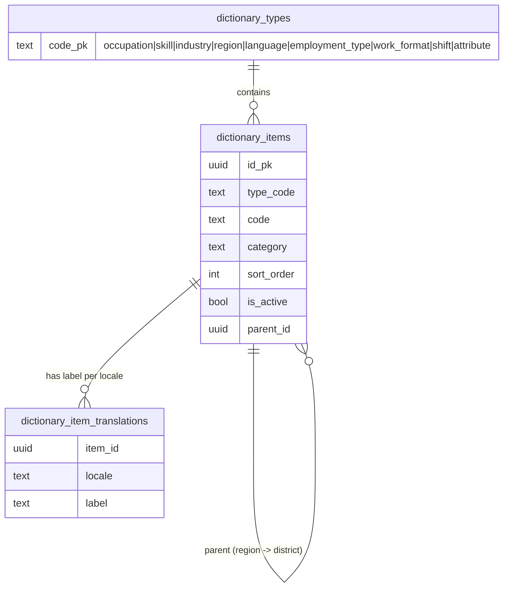
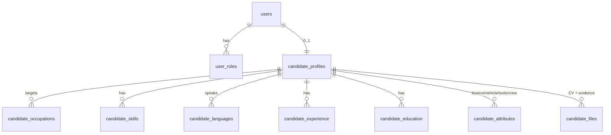

# headhunter-backend - Architecture

Design decisions for the Universal HeadHunter API, derived from
[docs/SPEC.md](docs/SPEC.md). Read this before adding a module; it explains the
few decisions that everything else depends on.

Companion client: `d:\Dev\tgbots\headhunter-app` (Flutter, Android + iOS).

---

## 1. What the specification forces

Five requirements drive nearly every structural decision. Everything else is
ordinary CRUD by comparison.

| Requirement | Source | Architectural consequence |
|---|---|---|
| Search must work identically in 4 interface variants | §3.3, BR-13 | Every filterable value is a **dictionary row with a stable ID**; labels are a separate translated table. Filters accept IDs, never text. |
| Candidate discovery must not depend on CV files | §1, §5.4 | The CV is an attachment. **Structured columns are authoritative** for all filtering. No CV parsing anywhere. |
| Profile fields adapt to work category | §5.2 | Occupations carry a **category**, and required/optional field sets are driven by that category server-side, not hardcoded per screen. |
| One account may hold several roles | §2.3 | `user_roles` is many-to-many. Authorization is evaluated per **(user, role, resource)** — never "the user's role". |
| Employer/vacancy actions are moderated and auditable | §1.1, §10.2, BR-08/BR-12 | Status changes go through explicit transitions that **always write an audit row**. Audit storage is append-only. |

Out of scope, and to be actively refused if requested mid-build (§2.4): public
website, desktop client, web admin panel, payroll/tax/HR records, in-app
payments, built-in video engine, automatic translation of user content,
automatic government-registry verification.

The admin panel lives **inside the mobile app** behind a role. There is no web
console, so admin endpoints are ordinary API endpoints with strict role guards -
not a separate service or auth scheme.

---

## 2. Module map

```
src/
  infra/                     cross-cutting: db, env, auth primitives, guards, files
  modules/
    auth/                    OTP, tokens, sessions, device confirmation
    users/                   identity, roles, locale, account status, deletion requests
    dictionaries/            occupations, skills, industries, regions, languages, attributes
    candidates/              candidate profile + experience/education/skills/languages/files
    employers/               company & individual employer profiles, verification submissions
    vacancies/               vacancy CRUD, requirements, status machine, moderation queue
    discovery/               candidate-facing vacancy search & recommendations
    candidate-search/        employer-facing structured candidate search, saves, shortlists
    applications/            applications, stage history, withdrawal
    invitations/             direct employer invitations and responses
    interviews/              scheduling and candidate responses
    chat/                    conversations, messages, read state
    notifications/           in-app records, push dispatch, preferences
    admin/                   dashboard, verification, moderation, users, dictionaries, audit
```

`discovery` and `candidate-search` are deliberately separate modules despite both
being "search": they have different authorization rules, different filter sets,
and different ranking. Merging them produces a permission-shaped mess.

Architecture is **lean modular** (Controller → Service → Repository once data
access earns one). No CQRS buses or DDD entities - see [CLAUDE.md](CLAUDE.md).

---

## 3. Localization model

### 3.1 Locale codes

Four interface variants, but only three languages - Uzbek ships in two scripts
(§3.1). Canonical internal codes:

| Canonical code | Interface option | `x-lang` aliases accepted |
|---|---|---|
| `uz-Latn` | O‘zbekcha (Lotin) | `uz`, `uz-latn`, `uz_Latn` |
| `uz-Cyrl` | Ўзбекча (Кирилл) | `oz`, `uz-cyrl`, `uz_Cyrl` |
| `ru` | Русский | `ru-RU` |
| `en` | English | `en-US`, `en-GB` |

**Why BCP-47 internally rather than the house `uz`/`oz` shorthand:** the Flutter
client's `Locale` maps to `uz-Latn` / `uz-Cyrl` directly, and `oz` is opaque to
anyone who has not seen it before. But `d:\Dev\digital-edo-api` already uses an
`x-lang` header with `uz`/`oz`, so the **header accepts those aliases** and
normalizes them. Alignment where it is free; no ambiguity in the data model.

Reuse the `XLang` decorator pattern from
`d:\Dev\digital-edo-api\src\infra\api\decorators\x-lang.decorator.ts`, but with a
strict allow-list and normalization to the canonical codes above - the existing
one passes arbitrary strings straight through, which we cannot do when the code
is used as a translation-table key.

### 3.2 Dictionary storage



Rules that follow from BR-13 and §3.2:

- `dictionary_items.id` is the **only** thing stored on profiles, vacancies and
  filters. A label is never persisted as a foreign value.
- A translation row is required for **all four locales** before an item may be
  activated. Enforce in the admin write path, and assert it with a test - a
  half-translated dictionary is how technical keys leak into the UI.
- Missing translation at read time falls back `uz-Cyrl→uz-Latn`, anything→`en`,
  and **logs a warning**. It must never return the code (§3.2).
- Deactivating an item keeps it resolvable for historical records; it only
  disappears from pickers. Never hard-delete a dictionary item that is
  referenced.
- Skills merging (§10.3) needs a `merged_into_id` column so old references
  resolve to the surviving item.

`region` is self-referencing (region → district/city). Languages carry CEFR
levels `A1..C2` plus `native`, stored as an ordered enum so `>= C1` is a range
comparison rather than a set membership test.

---

## 4. Candidate data model



Decisions:

- **`candidate_skills` / `candidate_languages` are rows, not JSON.** They are
  filtered with level comparisons and "match all" semantics; JSON containment
  cannot be indexed usefully for that.
- **`candidate_attributes` is a typed key/value table** keyed by dictionary item
  (driving licence, vehicle, tools, field-work readiness, crew work). §5.2 says
  the relevant attribute set varies by occupation category, so a fixed column per
  attribute would mean a migration per new work type. Value column is
  `bool`/`numeric`/`item_id` by attribute kind.
- **`visibility`** is an explicit enum: `searchable`, `hidden`,
  `visible_after_apply` (§5.1 Privacy). BR-02 means global search filters on
  `visibility = 'searchable' AND is_complete`.
- **`completeness_percent` and `is_complete` are stored, not computed per query.**
  Search filters on them (§7.1 "minimum completeness"), and recomputing across
  six child tables per search row is exactly the cost the 3-second budget cannot
  absorb. Recompute on profile write.
- **`last_meaningful_update_at`** is separate from `updated_at`: §5.3 requires
  showing the last *meaningful* update, and §7.1/§7.3 allow sorting by it.
  Touching a privacy toggle must not make a stale profile look fresh. Structural
  rather than conditional: visibility has its **own route**, which is the only
  write that does not refresh it, so no branch decides "was this meaningful".
- **`candidate_attributes` is the generic store for any engine field without a
  column or a child table of its own** - every §5.2 category field, plus the core
  multi-selects (employment type, work format, shift, industry). One row per scalar
  field, one row per selected id for a multi-select, keyed by the **schema field's
  code**. That is what makes an attribute filter an ordinary indexed join in M7 and
  a new work-type field a data change rather than a migration.
- **`gender` is a dictionary reference, not a native enum.** §4.2's `kind` union has
  no `enum` member, the four labels have to come from somewhere, and BR-12's vacancy
  restrictions must reference the same ids the profile stores. It is the 15th
  dictionary type; adding one is additive, because a field names its own
  `dictionaryType` and the client fetches whatever is named.
- **A calendar date is a string end to end.** `date` columns come back as
  `'YYYY-MM-DD'` (`infra/db/pg-types.ts` plus `--date-parser string`), because
  node-postgres otherwise parses one into local midnight - a value with a time and
  a zone standing in for one that has neither, which shifts a birth date by a day
  whenever the server's zone and the platform zone disagree.

### 4.1 Completeness (§5.3, BR-02)

Two answers from one pass, and the distinction matters:

- **`completeness_percent`** is measured over *every* entry the category's form has
  - engine fields plus experience and education as one entry each. A percentage over
  only the mandatory fields would move in 20-point jumps and tell an employer
  nothing (§7.1 filters on "minimum completeness").
- **`is_complete`** is only about the *required* entries. It is BR-02's gate, so it
  must never be a threshold on the percentage - "80% complete" would otherwise let a
  profile with no occupation into search.

`missingFields` carries both, flagged, so §5.3's "missing mandatory fields with
direct edit links" and the client's optional-gap prompts come from one list.

A consequence of the contract worth knowing: a bespoke section has no fields, so
`requiredForSearchable` can never name experience or education (§4.1 requires every
code there to resolve to a rendered field). BR-02 therefore never blocks on having
entered a job - completeness still counts them, so an empty history shows up as a
percentage rather than a locked profile.

### 4.2 The field schema is one declaration, not three

`modules/schemas/candidate-profile.schema.ts` is the client's form, the server's
write-validation table **and** the completeness definition. Each field carries its
labels, its requiredness per category, and where its value is stored.

*Why:* three separate lists are three chances for a field to be required in one and
unknown in another, and API_CONTRACTS.md §4.1 promises that every code in
`requiredForSearchable` resolves to a field the client can focus. With one
declaration that is true by construction; with three it is true until someone edits
one of them.

The published version lives in `schema_versions` and is copied there from the
declaration by `pnpm seed`. A content hash was rejected: not every edit needs a
refetch, and hashing would make a reordered comment invalidate every cached form.

---

## 5. Candidate search

The hardest performance requirement: first result page within 3 seconds under
normal load (§12.4), with ~11 filter groups (§7.1).

**Start with normalized tables and indexed joins. Do not build a search engine
yet.** Postgres handles this size of problem well, and a premature Elasticsearch
introduces an index-sync problem plus a second source of truth for privacy
rules - the one thing that must never drift.

Query shape:

- Filter `candidate_profiles` first on the cheap, highly selective, indexed
  predicates: `visibility`, `is_complete`, region, occupation, availability.
- **Skills "match all"** (§7.1): semi-join with
  `GROUP BY candidate_id HAVING COUNT(DISTINCT skill_id) = :n`.
  **"match any"**: plain `IN`. These are different plans; do not unify them
  behind one clever query.
- **Language + minimum level**: join on language item with `level_rank >= :rank`,
  which is why levels are an ordered enum.
- Indexes to create with the tables, not later: `candidate_occupations(item_id,
  candidate_id)`, `candidate_skills(item_id, level_rank)`,
  `candidate_languages(item_id, level_rank)`, and a composite on
  `candidate_profiles(visibility, is_complete, region_id)`.

**Count-before-open** (§7.2) is a separate cheaper endpoint returning only a
count. The spec says "where technically reasonable", so cap it: run the count
with a `LIMIT`-bounded estimate and return `{count, isExact}` so the client can
render "200+" rather than blocking on an exact count of a huge set.

**Ranking** (§7.3) needs a match score. Compute it as a weighted sum of matched
requirement groups in SQL, and return the per-group breakdown - "why did this
candidate rank here" is the first question an employer asks.

**Escape hatch, documented deliberately:** if measured p95 breaks the budget,
add a denormalized `candidate_search_projection` table maintained on profile
write, before considering a separate search engine.

Two hard authorization rules the search path must enforce server-side (§7, §11.1,
BR-09): only **verified** employers may search at all, and result cards must
never include phone or full contact details.

---

## 6. Vacancies, applications and status machines

Statuses are explicit and transitions are validated in one place per aggregate.

**Vacancy** (§6.4): `draft → under_moderation → active → paused → active`,
`active|paused → closed`, `under_moderation → rejected → draft`.

**Application** (§8.1): `submitted → viewed → shortlisted → interview → offer →
hired`, with `rejected` reachable from any employer-controlled stage and
`withdrawn` candidate-controlled up to an accepted offer (§5.6).

Enforcement points:

- **BR-07 (one active application per vacancy)** is a **partial unique index**,
  not a service-layer check: `UNIQUE (vacancy_id, candidate_id) WHERE status NOT
  IN ('withdrawn','rejected')`. A concurrent double-submit from a flaky mobile
  connection must fail in the database.
- **BR-06 (no applications after deadline or closure)** is checked in the same
  transaction as the insert, reading the vacancy `FOR SHARE`.
- **BR-08 (every status change recorded with time and actor)** →
  `application_stage_history(application_id, from_status, to_status, actor_user_id,
  actor_role, reason, created_at)`. Written in the same transaction as the status
  update. A status change without a history row is a bug, so make the service
  write both or neither.
- **BR-05** worker count `>= 1` as a check constraint.
- **BR-12** age/gender restrictions on a vacancy require a stored justification
  and force `under_moderation`; the audit row records the admin decision.
- **BR-11** closed vacancies leave active discovery but stay in history - a
  status filter, never a delete.

---

## 7. Offline-safe writes and idempotency

§12.4 requires "safe retry without duplicate application, invitation, or message
creation". Mobile clients retry; assume it.

Every non-idempotent write endpoint (apply, invite, send message, schedule
interview, upload) accepts an **`Idempotency-Key` header**. Keys are stored with
the resulting resource id and a request fingerprint:

- Same key + same fingerprint → return the original response, do not re-execute.
- Same key + different fingerprint → `409`, because the client reused a key for a
  different request.
- Keys expire after a documented retention window.

This is separate from BR-07's unique index: the index prevents logical
duplicates, idempotency keys make an interrupted-but-successful request safe to
retry and let the client distinguish "already done" from "conflict".

---

## 8. Authorization

Multi-role accounts (§2.3) mean the question is never "what role is this user"
but "may this user, acting as role R, do this to resource X".

- Access token carries `sub`, `roles[]`, and an **`active_role`** claim; the
  client switches role explicitly and the server validates the requested role is
  actually granted.
- Guards compose: authenticated → role granted → resource ownership → account
  status. Follow the guard layout in
  `d:\Dev\digital-edo-api\src\infra\api\guards\` (`authorization.guard.ts`,
  `role.guard.ts`, `permission.guard.ts`) - same shape, same testing approach.
- **BR-10 (blocked users)** is enforced by a guard on every mutating route, not
  per module. A blocked account must fail vacancy, application, invitation and
  message creation with a clear reason (§13.1 UAT-14).
- **BR-03**: employer profile completeness is a precondition on invitation and
  vacancy-submit routes.
- **BR-09**: contact-detail exposure is decided in one serializer helper that
  takes (viewer, candidate, interaction state). Never inline this rule per
  endpoint - it will drift, and drifting is a privacy incident.

### Auth flow

**Decided 2026-08-05 (client direction, second): login is §4.1's phone + OTP.** This
supersedes the Telegram decision taken earlier the same day; that path is now
deprecated but still working, and is documented below because its reasoning is worth
keeping.

The flow is `POST /auth/otp/send` then `POST /auth/otp/verify`, both public, both rate
limited per phone and per IP. Registration and login are the same pair of calls — the
client cannot know which it is performing, and a route that distinguished them would be
a register of which numbers have accounts. Consuming a code is what verifies the
number, so BR-01 holds by construction rather than by a separate check.

**No SMS provider is bought yet, and that shaped exactly one line of code.**
`OTP_STATIC_CODE` substitutes a fixed code at the point `generateOtpCode` would be
called, inside the same transaction, and nowhere else. Everything downstream — the
hash, the row, the TTL, supersession of the previous code, the attempt counter, the
`FOR UPDATE` lock, single-use consumption — is the production path, exercised by the
same tests.

*Why the substitution goes there and not in `verify`:* a `verify` that accepted a magic
value would be a second, simpler code path, and the day the provider arrives the branch
that has actually been exercised is deleted and the one nobody has run becomes live.
Putting it at generation means clearing one environment variable is the entire removal.

*Why it is refused in production by Joi rather than by a note in a runbook:* a fixed
code is a master key to every account on the instance. `NODE_ENV=production` with a
non-empty `OTP_STATIC_CODE` fails at boot; a mismatch against `OTP_LENGTH` also fails
at boot, because the alternative is a client rendering six input boxes for a code that
does not fit them. And while it is set, every startup logs a warning.

*What is still owed:* the provider itself — Eskiz.uz, per client direction — plus the
delivery seam it plugs into. `OtpService.send` currently issues and stores a code and
tells nobody; sending is additive, and the natural shape is one injected sender
interface with a no-op implementation, added when there is a second implementation to
justify it.

#### Telegram login *(deprecated 2026-08-05, still working)*

Kept rather than deleted: the verification is correct, its tests run, and it remains
the cheapest way to re-add a verified-identity path. Setup guide:
[docs/TELEGRAM_LOGIN_SETUP.md](docs/TELEGRAM_LOGIN_SETUP.md).

The app uses Telegram's official native SDKs, which run OAuth2 + PKCE against
`oauth.telegram.org` app-to-app and return an OpenID Connect `id_token`. The client
posts that token to `POST /auth/telegram`; we verify it and issue our own session.

Four checks decide whether a token is trusted, and the third is the load-bearing one:

1. **Signature** against Telegram's JWKS — `jose` handles `kid` selection and key
   rotation, which is the part not worth hand-rolling on a security path.
2. **Issuer** is exactly `https://oauth.telegram.org`.
3. **Audience is our bot id.** A genuine, correctly signed Telegram token issued for
   any other application must not sign anyone in here, and this check is the only
   thing preventing it. It is what makes accepting a client-supplied `id_token` sound
   rather than merely convenient — the same reasoning as Google or Apple sign-in on
   mobile.
4. **Age** — `iat` within a short window, so a captured token is refused while `exp`
   is still in the future. OIDC's `nonce` is the stronger defence but needs the client
   SDK to accept a server-issued nonce, which the current Flutter package does not
   expose; the claim is verified when present, ready for that.

**Identity model consequences.** `telegram_user_id` becomes the credential and
`users.phone` becomes nullable, with a CHECK that at least one is present — a row
with neither is unreachable by every login path. The `phone` scope's
`phone_number_verified` claim is what keeps the product's phone-based model working,
and `TELEGRAM_REQUIRE_PHONE` (default on) refuses a login without it: BR-09 contact
exposure has nothing to reveal without a phone number, and telling the user at login
beats letting them discover it after building a profile.

**Account linking** is what makes the switch survivable. A Telegram login carrying a
verified phone that matches an unclaimed account attaches to it, with an audit row,
rather than creating a duplicate. Only a Telegram-verified phone is ever matched on;
matching an unverified one would be an account-takeover primitive. An account already
claimed by a different Telegram user is never taken over — realistic rather than
theoretical, since mobile numbers are recycled.

Common to both paths: OTP records store a **hash**, never the code; TTL, resend delay
and attempt limits are server config (§4.2). Rate limit per phone **and** per IP
(§12.5). Sessions are listed and individually revocable, plus "terminate all" (§4.2).
Refresh tokens rotate on use with reuse detection.

Still owed from §4.2 either way: new-device and phone-change confirmation.

---

## 9. Files

§11.1 forbids permanently public links; §5.4 requires CV upload/replace/delete
with progress and retry; §12.5 requires type/size validation and malware scanning
where infrastructure permits.

**Decided 2026-08-04: storage is the Telegram Bot API.** Bytes are sent with
`sendDocument` to one fixed chat; a `stored_files` row owned by this service holds
the metadata; retrieval is `getFile` followed by a download. Client direction, and
it removes an object-storage dependency from the deployment entirely.

What that choice forces, and why the code looks the way it does:

- **Downloads are proxied, not redirected.** Telegram's file URL is
  `api.telegram.org/file/bot<token>/<path>` — unauthenticated, and it contains the
  bot token. It can never reach a client, so `GET /files/:id/content` streams the
  bytes after an ownership check. This satisfies §11.1 more strictly than signed
  URLs would: there is no URL to leak.
- **The ceiling is 20 MB, not 50.** A bot may *send* 50 MB but `getFile` refuses to
  *download* above 20 MB, so the upload limit is validated against the download
  ceiling at boot. Above it, a file would store successfully and be permanently
  unreadable. The client contract's 10 MB (§4.1) sits comfortably under.
- **No path is ever persisted.** It expires in about an hour, so it is fetched per
  download.
- **`file_id` is per-bot.** Replacing `TELEGRAM_BOT_TOKEN` orphans every stored
  file rather than merely re-authenticating, which makes the token part of the data
  layer. `file_unique_id` is stored alongside because it is stable across bots and
  is what a future migration would reconcile against.
- **A SHA-256 of the uploaded bytes is stored and verified on read.** Serving an
  employer a document that is not the one the candidate uploaded is worse than
  serving none.
- **Deletes are soft**, and Telegram's message deletion is best effort — it refuses
  messages older than 48 hours. The metadata row is what every read goes through,
  so a deleted row is unreachable regardless of the residue in the chat.

Two consequences worth stating plainly, since they are properties of the storage
choice rather than of the code: uploaded documents live in a Telegram chat, so that
chat's membership is part of this product's privacy surface and it should be a
private channel whose only other member is the bot; and file retention is bounded
by that chat's existence, not by our database.

Validation is content-based (§12.5): extension, declared MIME type and magic bytes
must agree, which is what stops a renamed executable being accepted as a CV. A
generic `application/octet-stream` is tolerated because mobile pickers send it.
This is not malware scanning; §12.5 asks for that "where infrastructure permits",
and Telegram performs none on a bot upload.

---

## 10. Chat, interviews, notifications

- **Chat is gated, not open** (§9.1): a conversation may only exist where an
  application, invitation, or other permitted interaction exists. The gate is a
  server-side check on conversation creation *and* on message send - a
  conversation whose interaction later closes becomes read-only (§9.1).
- Messages support text and approved attachments. Sent/delivered/read state is
  per-recipient. **No voice or video** (§2.4); an interview may carry an external
  meeting link as a plain string (§8.3).
- **Interviews** store type (phone/in-person/external link), timestamp in the
  configured zone, location-or-link required by type, instructions, and the
  candidate's confirm / request-another-time response.
- **Notifications** (§9.2): nine event types, each with a defined recipient. Every
  notification is an in-app row plus a push attempt. Preferences may disable
  non-critical categories; **security and account notices are not disableable**.
  Store the notification independent of push success - push is best-effort, the
  in-app list is the record.

---

## 11. Non-functional budget

| Area | Target (§12.4) | How we hold it |
|---|---|---|
| Standard API | p95 < 2s at normal load | Indexed queries, no N+1, pagination everywhere by default |
| Search first page | < 3s | §5 query strategy; measure before optimizing |
| Files | progress, cancel, failure reason, retry | Signed URLs, client-driven upload |
| Offline | no duplicate writes | §7 idempotency |
| Availability | monitoring, scheduled backups, documented restore | Ops task in M11, not an afterthought |

Rate limiting is required on OTP, authentication, search, messaging and file
operations (§12.5) - five distinct buckets with different budgets, not one global
limiter.

Logging must not expose sensitive user data (§12.1). pino redaction is already
configured for auth headers and cookies; extend it as fields are added, and never
log OTP codes, tokens, or full phone numbers.

---

## 12. Deliberately deferred

Not in v1, and each would be a scope change: employer analytics beyond the
dashboard widgets in §6.2, saved-search alerts, candidate-to-candidate messaging,
CV parsing, recommendation ML (§5.5 "recommended" is rule-based matching on
occupation/location/preferences), and any government-registry integration (§2.4).

---

## 13. Open questions for the client

Answers change the schema, so raise them before the affected milestone:

1. **Retention periods** for account deletion and audit logs - BR-14 defers to
   "the approved privacy policy", which we do not have yet.
2. **Verification evidence** required for individual (non-company) employers
   (§6.1 says "if required by policy").
3. **Conditional filters** (§7.1, BR-12): the legally permitted justifications for
   age/gender filtering need to be enumerated, since moderation must check them.
4. **Dictionary value lists** (§13.2). No longer blocking: every type is seeded and
   working, but four of them carry a conventional default rather than an approved
   list, and the occupation set is a starting point rather than a classifier. See
   `src/modules/dictionaries/seed/` - each type states its provenance.

*Answered:* time zone (single platform zone `Asia/Tashkent`), push provider
(deferred with M9), file service (Telegram Bot API, §9 above).
